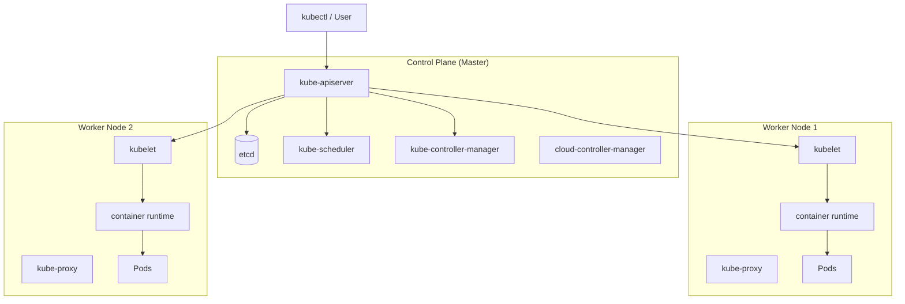
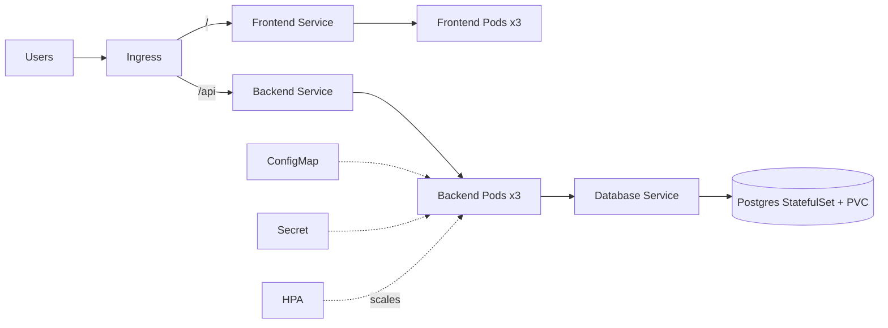

# Kubernetes: From Absolute Basics to Production

> A complete, beginner-friendly Kubernetes trainer. Read top to bottom. Every section has **simple explanations**, **commands**, **YAML examples**, **hands-on tasks**, **troubleshooting cases**, **interview questions**, and **real-time scenarios**.

---

## Table of Contents

1. [What is Kubernetes & Why It Is Needed](#1-what-is-kubernetes--why-it-is-needed)
2. [Containers, Docker & The Problem K8s Solves](#2-containers-docker--the-problem-k8s-solves)
3. [Kubernetes Architecture](#3-kubernetes-architecture)
4. [Setting Up Your Practice Environment](#4-setting-up-your-practice-environment)
5. [kubectl Basics](#5-kubectl-basics)
6. [Pods](#6-pods)
7. [ReplicaSets & Deployments](#7-replicasets--deployments)
8. [Services](#8-services)
9. [Ingress](#9-ingress)
10. [ConfigMaps & Secrets](#10-configmaps--secrets)
11. [Storage: Volumes, PV, PVC, StorageClass](#11-storage-volumes-pv-pvc-storageclass)
12. [Namespaces, Labels, Selectors & Annotations](#12-namespaces-labels-selectors--annotations)
13. [Autoscaling (HPA, VPA, Cluster Autoscaler)](#13-autoscaling-hpa-vpa-cluster-autoscaler)
14. [Health Checks: Probes](#14-health-checks-probes)
15. [Resource Requests, Limits & QoS](#15-resource-requests-limits--qos)
16. [StatefulSets, DaemonSets, Jobs & CronJobs](#16-statefulsets-daemonsets-jobs--cronjobs)
17. [RBAC & Security](#17-rbac--security)
18. [Monitoring & Logging](#18-monitoring--logging)
19. [Troubleshooting Playbook](#19-troubleshooting-playbook)
20. [Helm: The Package Manager](#20-helm-the-package-manager)
21. [Real-Time Production Project](#21-real-time-production-project)
22. [Production Best Practices Checklist](#22-production-best-practices-checklist)
23. [Top Interview Questions (Consolidated)](#23-top-interview-questions-consolidated)

---

## 1. What is Kubernetes & Why It Is Needed

### Simple explanation
Kubernetes (often written as **K8s** — "K", then 8 letters, then "s") is an **open-source system that automatically runs, scales, and manages containerized applications** across many machines.

Think of it as the **operations manager of a large restaurant**:
- You (the developer) cook the dishes (build app containers).
- Kubernetes decides which kitchen station (server) cooks what, how many cooks are needed during rush hour (scaling), replaces a cook who quits (self-healing), and makes sure customers reach the right counter (networking).

### Why is it needed? (The real-world problem)
Before Kubernetes, teams faced these problems:

| Problem | Without K8s | With K8s |
|---|---|---|
| A server crashes at 2 AM | Engineer wakes up, manually restarts app | K8s restarts it automatically |
| Traffic spikes on Black Friday | Manually add servers, hope it's fast enough | K8s **auto-scales** pods up/down |
| Deploy new version | Stop app, copy files, restart (downtime) | **Rolling update** with zero downtime |
| App works on dev but not prod | "Works on my machine" chaos | Same container runs everywhere |
| Run 100s of microservices | Track each one by hand | K8s schedules & tracks them all |

### How it is used in real projects
- **Netflix, Spotify, Airbnb** run thousands of microservices on Kubernetes.
- A typical company packages each microservice (login, payment, search) as a container, then K8s runs many copies, balances traffic, heals failures, and scales during peak hours.
- Used across **cloud providers**: AWS (EKS), Google (GKE), Azure (AKS), and on-premise data centers.

### Key benefits (memorize these)
1. **Self-healing** — restarts failed containers automatically.
2. **Horizontal scaling** — add/remove copies based on load.
3. **Service discovery & load balancing** — built-in networking.
4. **Automated rollouts & rollbacks** — safe deployments.
5. **Declarative configuration** — you describe the *desired state* in YAML; K8s makes reality match it.
6. **Portability** — runs on any cloud or on-prem.

> 🔑 **Core idea: Declarative model.** You don't tell K8s *how* to do things step by step. You declare *what you want* ("I want 3 copies of my app running") and Kubernetes continuously works to make it true.

### 🧪 Hands-on task
Write down (on paper) 3 applications you use daily (e.g., WhatsApp, Gmail, Instagram) and imagine why each needs scaling, self-healing, and zero-downtime deployments.

### 🎯 Interview Questions
1. **What is Kubernetes?** — An open-source container orchestration platform that automates deployment, scaling, and management of containerized applications.
2. **Why do we need Kubernetes when we already have Docker?** — Docker runs containers on a single host. Kubernetes orchestrates containers across **many hosts**, adding self-healing, scaling, load balancing, and rollouts.
3. **What does "declarative" mean in Kubernetes?** — You define the desired state in manifests; the control loop reconciles actual state to match it.
4. **Name 4 key features of Kubernetes.** — Self-healing, autoscaling, service discovery/load balancing, automated rollouts/rollbacks.

### 🏭 Real-Time Scenario
> *"Your e-commerce site gets 10x traffic during a flash sale. How does Kubernetes help?"*
>
> K8s **Horizontal Pod Autoscaler** detects high CPU/traffic and automatically creates more pods. A **Service + LoadBalancer** distributes requests across them. When the sale ends, it scales back down to save cost. If any pod crashes under load, K8s **restarts it automatically**.

---

## 2. Containers, Docker & The Problem K8s Solves

### What is a container?
A **container** packages your application + all its dependencies (libraries, runtime, config) into a single, isolated, lightweight unit that runs identically anywhere.

**Analogy:** A shipping container — whatever is inside, it fits on any ship, truck, or crane because the *outside* is standardized.

### Container vs Virtual Machine
| | Virtual Machine | Container |
|---|---|---|
| Includes | Full OS + app | Just app + dependencies |
| Size | GBs | MBs |
| Startup | Minutes | Seconds |
| Isolation | Strong (own kernel) | Process-level (shared kernel) |

### Where Docker fits
- **Docker** builds and runs containers.
- A **Docker image** is the blueprint; a **container** is a running instance of that image.

```bash
# Build an image from a Dockerfile
docker build -t myapp:1.0 .

# Run a container
docker run -d -p 8080:80 myapp:1.0

# List running containers
docker ps
```

### The gap Docker leaves
Docker runs containers on **one machine**. But production needs:
- Hundreds of containers across **many machines**.
- Automatic restart when one dies.
- Load balancing across copies.
- Rolling updates without downtime.

➡️ **Kubernetes fills this gap** — it's the orchestrator that manages Docker (or other runtime) containers at scale.

> Note: Modern Kubernetes uses **containerd** or **CRI-O** as the container runtime (Docker's runtime was deprecated as a direct K8s runtime in v1.24), but your Docker images still work fine because they follow the **OCI standard**.

### 🧪 Hands-on task
1. Install Docker.
2. Run `docker run -d -p 8080:80 nginx`.
3. Open `http://localhost:8080` — you just ran a containerized web server.

### 🎯 Interview Questions
1. **Difference between a container and a VM?** — Containers share the host kernel and are lightweight; VMs include a full guest OS and are heavier.
2. **Difference between a Docker image and a container?** — Image is the static blueprint; container is a running instance.
3. **Did Kubernetes "remove Docker"?** — It removed the Docker *runtime shim* (`dockershim`); Docker-built OCI images still run via containerd/CRI-O.

### 🏭 Real-Time Scenario
> *"A developer says 'it works on my machine but fails in production.' How do containers help?"*
>
> The container bundles the exact runtime, libraries, and config. The same image runs in dev, test, and prod — eliminating environment drift.

---

## 3. Kubernetes Architecture

A Kubernetes **cluster** = **Control Plane** (the brain) + **Worker Nodes** (the muscle).



### Control Plane components (the brain)
| Component | Role (simple) |
|---|---|
| **kube-apiserver** | The **front door**. Every command/request goes through it. Exposes the Kubernetes API. |
| **etcd** | The **database**. A key-value store holding the entire cluster state (the "source of truth"). |
| **kube-scheduler** | The **placement decider**. Chooses which node a new pod runs on based on resources/constraints. |
| **kube-controller-manager** | The **watcher**. Runs control loops (node, replicaset, job controllers) to keep actual state = desired state. |
| **cloud-controller-manager** | Talks to the **cloud provider** (load balancers, storage, nodes). |

### Worker Node components (the muscle)
| Component | Role (simple) |
|---|---|
| **kubelet** | The **node agent**. Talks to the API server, ensures containers in pods are running and healthy. |
| **kube-proxy** | The **network rules manager**. Handles pod networking & load balancing on the node. |
| **Container runtime** | Actually **runs containers** (containerd, CRI-O). |

### The reconciliation loop (the heart of K8s)
```
Desired State (your YAML)  ──►  API Server  ──►  etcd
                                     ▲
                                     │ controllers continuously compare
                                     ▼
                              Actual State (real pods)
        If they differ → K8s takes action to fix it
```

**Example:** You declare "3 replicas". One pod dies → controller notices "actual=2, desired=3" → creates a new pod. This loop never stops.

### 🧪 Hands-on task
After installing a cluster (next section), run:
```bash
kubectl get componentstatuses        # health of control plane (older clusters)
kubectl get nodes -o wide            # see your nodes
kubectl get pods -n kube-system      # see control-plane & system pods
```

### 🎯 Interview Questions
1. **What are the control plane components?** — api-server, etcd, scheduler, controller-manager, cloud-controller-manager.
2. **What is etcd and why is it critical?** — A distributed key-value store holding all cluster state; if you lose it, you lose the cluster's memory. Always back it up.
3. **What does the scheduler do?** — Decides which node an unscheduled pod should run on based on resource requests, taints/tolerations, affinity, etc.
4. **What is kubelet?** — The agent on each node that ensures the containers described in PodSpecs are running and healthy.
5. **What is the role of kube-proxy?** — Maintains network rules enabling Service communication and load balancing.
6. **Explain the reconciliation loop.** — Controllers continuously compare desired vs actual state and act to converge them.

### 🏭 Real-Time Scenario
> *"etcd is down. What happens?"*
>
> The cluster can't read/write state. You can't create/update/delete resources. Running pods keep running (kubelet has local cache), but no new scheduling or changes happen. **Lesson:** etcd must be highly available (odd number — 3 or 5 nodes) and backed up.

---

## 4. Setting Up Your Practice Environment

You need a cluster to practice. For learning, use a **local single-node cluster**.

### Option A: Minikube (recommended for beginners)
```bash
# Install kubectl (the CLI)
# Linux:
curl -LO "https://dl.k8s.io/release/$(curl -L -s https://dl.k8s.io/release/stable.txt)/bin/linux/amd64/kubectl"
sudo install -o root -g root -m 0755 kubectl /usr/local/bin/kubectl

# Install minikube
curl -LO https://storage.googleapis.com/minikube/releases/latest/minikube-linux-amd64
sudo install minikube-linux-amd64 /usr/local/bin/minikube

# Start a cluster
minikube start

# Verify
kubectl get nodes
```

### Option B: kind (Kubernetes in Docker)
```bash
# Install kind
curl -Lo ./kind https://kind.sigs.k8s.io/dl/latest/kind-linux-amd64
chmod +x ./kind && sudo mv ./kind /usr/local/bin/kind

# Create cluster
kind create cluster --name learning
kubectl cluster-info --context kind-learning
```

### Option C: Managed cloud (for production-like practice)
- **GKE** (Google), **EKS** (AWS), **AKS** (Azure) — real production clusters (cost money).

### Useful minikube extras
```bash
minikube dashboard         # web UI
minikube addons enable ingress      # enable ingress controller
minikube addons enable metrics-server   # needed for autoscaling/top
minikube stop              # stop cluster
minikube delete            # delete cluster
```

### 🧪 Hands-on task
Install minikube, run `minikube start`, then confirm `kubectl get nodes` shows one `Ready` node.

---

## 5. kubectl Basics

`kubectl` is the **command-line tool** to talk to your cluster (via the API server).

### Command structure
```
kubectl <verb> <resource-type> <name> [flags]
        get    pods            mypod   -n default
```

### Essential commands (your daily bread)
```bash
# View resources
kubectl get pods                       # list pods in current namespace
kubectl get pods -A                    # all namespaces
kubectl get pods -o wide               # more detail (node, IP)
kubectl get all                        # pods, services, deployments, etc.
kubectl get deploy,svc,ingress         # multiple types

# Detailed info / debugging
kubectl describe pod <name>            # events + full details (GREAT for debugging)
kubectl logs <pod>                     # container logs
kubectl logs <pod> -c <container>      # specific container in multi-container pod
kubectl logs -f <pod>                  # follow (stream) logs
kubectl logs <pod> --previous          # logs from the crashed previous instance

# Execute / interact
kubectl exec -it <pod> -- /bin/sh      # open a shell inside a pod
kubectl exec <pod> -- env              # run a command inside

# Create / apply
kubectl apply -f file.yaml             # create OR update from YAML (declarative)
kubectl create -f file.yaml            # create (fails if exists)
kubectl delete -f file.yaml            # delete resources defined in file
kubectl delete pod <name>              # delete a single resource

# Imperative quick-create (handy for tests)
kubectl run nginx --image=nginx        # create a single pod
kubectl create deployment web --image=nginx --replicas=3

# Editing / scaling
kubectl edit deployment <name>         # edit live (opens editor)
kubectl scale deployment <name> --replicas=5
kubectl set image deployment/<name> <container>=<image>:<tag>

# Context & namespaces
kubectl config get-contexts
kubectl config use-context <ctx>
kubectl config set-context --current --namespace=<ns>

# Dry-run + generate YAML (VERY useful)
kubectl create deployment web --image=nginx --dry-run=client -o yaml > deploy.yaml

# Explain any field (built-in docs)
kubectl explain pod.spec.containers
```

### Imperative vs Declarative
- **Imperative**: you run commands that *do* things (`kubectl create`, `kubectl run`). Good for quick tests.
- **Declarative**: you write YAML and `kubectl apply -f`. K8s figures out the changes. **Use this in production** (version-controlled, repeatable).

### 🧪 Hands-on task
```bash
kubectl run hello --image=nginx
kubectl get pods
kubectl describe pod hello
kubectl logs hello
kubectl exec -it hello -- /bin/sh   # type 'exit' to leave
kubectl delete pod hello
```

### 🎯 Interview Questions
1. **Difference between `kubectl apply` and `kubectl create`?** — `create` is imperative and fails if the resource exists; `apply` is declarative, creates or updates, and tracks changes.
2. **How do you debug a failing pod?** — `kubectl describe pod` (check events), `kubectl logs` (check app errors), `kubectl get events`.
3. **What does `kubectl get all` show?** — Common resources (pods, services, deployments, replicasets) in the namespace — *not literally everything*.
4. **How to generate YAML without applying?** — `--dry-run=client -o yaml`.

### 🏭 Real-Time Scenario
> *"You need to quickly check why an app isn't responding."*
>
> `kubectl get pods` → see if it's `Running`. If `CrashLoopBackOff`, run `kubectl logs <pod> --previous` to see why it crashed, and `kubectl describe pod` to read events.

---

## 6. Pods

### What is a Pod?
A **Pod** is the **smallest deployable unit** in Kubernetes. It wraps **one or more containers** that:
- Share the same **network** (same IP, can talk via `localhost`).
- Share **storage volumes**.
- Are always scheduled **together** on the same node.

> 🔑 You usually run **one container per pod**. Multiple containers in one pod is for tightly-coupled helpers (the **sidecar** pattern).

### Pod YAML (your first manifest)
```yaml
apiVersion: v1
kind: Pod
metadata:
  name: nginx-pod
  labels:
    app: nginx
spec:
  containers:
    - name: nginx
      image: nginx:1.25
      ports:
        - containerPort: 80
```

```bash
kubectl apply -f pod.yaml
kubectl get pods
kubectl describe pod nginx-pod
```

### Multi-container pod (sidecar example)
```yaml
apiVersion: v1
kind: Pod
metadata:
  name: app-with-logger
spec:
  containers:
    - name: app
      image: myapp:1.0
    - name: log-shipper        # sidecar that ships logs
      image: fluent/fluent-bit
  volumes:
    - name: shared-logs
      emptyDir: {}
```

### Why you rarely create pods directly
A bare Pod is **not self-healing** — if it dies, it's gone. Instead you use **Deployments** (next section) which recreate pods automatically.

### Pod lifecycle phases
`Pending` → `Running` → `Succeeded` / `Failed`. (Plus `Unknown`.)

### 🧪 Hands-on task
Create the `nginx-pod` above, then:
```bash
kubectl get pod nginx-pod -o yaml      # see full state K8s added
kubectl delete pod nginx-pod
kubectl get pods                        # it's gone, NOT recreated (no controller)
```

### 🎯 Interview Questions
1. **What is a Pod?** — The smallest deployable unit; one or more containers sharing network and storage.
2. **Can a pod have multiple containers?** — Yes (sidecar pattern); they share IP and volumes.
3. **Why not deploy pods directly in production?** — No self-healing/scaling; use Deployments/controllers.
4. **What are pod phases?** — Pending, Running, Succeeded, Failed, Unknown.

### 🏭 Real-Time Scenario
> *"Your app container needs a helper to push logs to a central system."*
>
> Use a **sidecar container** in the same pod sharing an `emptyDir` volume — app writes logs, sidecar ships them.

---

## 7. ReplicaSets & Deployments

### ReplicaSet
A **ReplicaSet** ensures a specified number of identical pods are always running. If one dies, it creates a replacement.

You rarely create ReplicaSets directly — **Deployments manage them for you**.

### Deployment (the workhorse of K8s)
A **Deployment** manages ReplicaSets and provides:
- **Declarative updates** to pods.
- **Rolling updates** (zero downtime).
- **Rollbacks** to previous versions.
- **Scaling**.

```yaml
apiVersion: apps/v1
kind: Deployment
metadata:
  name: nginx-deployment
  labels:
    app: nginx
spec:
  replicas: 3
  selector:
    matchLabels:
      app: nginx
  template:                 # pod template
    metadata:
      labels:
        app: nginx
    spec:
      containers:
        - name: nginx
          image: nginx:1.25
          ports:
            - containerPort: 80
          resources:
            requests:
              cpu: "100m"
              memory: "128Mi"
            limits:
              cpu: "250m"
              memory: "256Mi"
```

```bash
kubectl apply -f deployment.yaml
kubectl get deployments
kubectl get replicasets
kubectl get pods                       # 3 pods running

# Scaling
kubectl scale deployment nginx-deployment --replicas=5

# Update image (triggers rolling update)
kubectl set image deployment/nginx-deployment nginx=nginx:1.26

# Watch the rollout
kubectl rollout status deployment/nginx-deployment

# Rollout history
kubectl rollout history deployment/nginx-deployment

# Rollback to previous version
kubectl rollout undo deployment/nginx-deployment

# Rollback to specific revision
kubectl rollout undo deployment/nginx-deployment --to-revision=2
```

### How rolling updates work
K8s creates new pods with the new version while gradually removing old ones, controlled by:
```yaml
spec:
  strategy:
    type: RollingUpdate
    rollingUpdate:
      maxSurge: 1          # max extra pods above desired during update
      maxUnavailable: 1    # max pods that can be unavailable during update
```

**Other strategy:** `Recreate` (kill all old, then create new — causes downtime, used when versions can't coexist).

### 🧪 Hands-on task
1. Deploy the nginx deployment with 3 replicas.
2. Delete one pod: `kubectl delete pod <name>` → watch it get recreated.
3. Update image to `nginx:1.26` and watch `kubectl get pods -w`.
4. Roll back and confirm.

### 🎯 Interview Questions
1. **Deployment vs ReplicaSet?** — Deployment manages ReplicaSets and adds rolling updates/rollbacks; ReplicaSet only maintains pod count.
2. **How does a rolling update achieve zero downtime?** — New pods are brought up and become Ready before old ones are terminated, governed by maxSurge/maxUnavailable.
3. **How do you roll back a bad deployment?** — `kubectl rollout undo deployment/<name>`.
4. **What is `maxSurge` and `maxUnavailable`?** — Controls how many extra/unavailable pods are allowed during an update.
5. **Difference between RollingUpdate and Recreate strategies?** — RollingUpdate is gradual/zero-downtime; Recreate terminates all old pods first (downtime).

### 🏭 Real-Time Scenario
> *"You deployed v2 and users report errors. What do you do?"*
>
> Immediately `kubectl rollout undo deployment/<name>` to revert to v1. Then investigate v2 logs in a staging environment. Keep `revisionHistoryLimit` set so rollbacks are possible.

---

## 8. Services

### The problem Services solve
Pods are **ephemeral** — they die and get recreated with **new IP addresses**. You can't rely on a pod's IP. A **Service** gives a **stable, permanent address** and **load-balances** traffic across a set of pods.

A Service finds its pods using **label selectors**.

### Service types
| Type | What it does | Use case |
|---|---|---|
| **ClusterIP** (default) | Stable internal IP, reachable only inside cluster | Internal microservice-to-microservice |
| **NodePort** | Exposes service on a static port on every node's IP | Quick external access (dev/test) |
| **LoadBalancer** | Provisions a cloud load balancer with external IP | Production external access (cloud) |
| **ExternalName** | Maps service to an external DNS name | Point to external DB/API |

### ClusterIP example
```yaml
apiVersion: v1
kind: Service
metadata:
  name: nginx-service
spec:
  type: ClusterIP
  selector:
    app: nginx            # matches pods with label app=nginx
  ports:
    - protocol: TCP
      port: 80            # service port (what clients call)
      targetPort: 80      # container port (where it forwards)
```

### NodePort example
```yaml
apiVersion: v1
kind: Service
metadata:
  name: nginx-nodeport
spec:
  type: NodePort
  selector:
    app: nginx
  ports:
    - port: 80
      targetPort: 80
      nodePort: 30080     # external port (range 30000-32767)
```

### LoadBalancer example
```yaml
apiVersion: v1
kind: Service
metadata:
  name: nginx-lb
spec:
  type: LoadBalancer
  selector:
    app: nginx
  ports:
    - port: 80
      targetPort: 80
```

```bash
kubectl apply -f service.yaml
kubectl get svc
kubectl describe svc nginx-service
kubectl get endpoints nginx-service     # shows which pod IPs back the service
```

### Service discovery (DNS)
Inside the cluster, every Service gets a DNS name:
```
<service-name>.<namespace>.svc.cluster.local
```
So a frontend pod can reach the backend at `http://backend-service:80` (same namespace) — **no IPs needed**.

### 🧪 Hands-on task
1. Deploy nginx (3 replicas).
2. Create a ClusterIP service.
3. `kubectl run tmp --image=busybox -it --rm -- wget -qO- nginx-service` → see HTML response load-balanced across pods.
4. Check `kubectl get endpoints nginx-service` — see 3 pod IPs.

### 🎯 Interview Questions
1. **Why do we need Services?** — Pods are ephemeral with changing IPs; Services give a stable endpoint and load balancing.
2. **Explain ClusterIP, NodePort, LoadBalancer.** — Internal-only / per-node static port / cloud external LB.
3. **How does a Service know which pods to route to?** — Label selectors → Endpoints.
4. **What is an Endpoint object?** — The list of pod IPs:ports that a Service routes to.
5. **How does service discovery work?** — Via cluster DNS (CoreDNS); services are reachable by name.

### 🏭 Real-Time Scenario
> *"Your frontend can't reach the backend."*
>
> Check: (1) `kubectl get endpoints backend` — empty means the **selector doesn't match** pod labels. (2) Verify ports (`targetPort` vs containerPort). (3) Confirm same namespace or use FQDN. (4) Test with a temp busybox pod.

---

## 9. Ingress

### The problem
`LoadBalancer` services give each service its own external IP/LB — **expensive and hard to manage** with many services. **Ingress** provides a single entry point that routes HTTP/HTTPS traffic to multiple services based on **host** or **path**.

### Ingress vs Service
- **Service** = L4 (TCP/UDP) load balancing.
- **Ingress** = L7 (HTTP/HTTPS) routing with host/path rules, TLS termination, one entry point for many services.

### You need an Ingress Controller
Ingress rules do nothing without a controller (the actual proxy). Common one: **NGINX Ingress Controller**. Enable in minikube:
```bash
minikube addons enable ingress
```

### Ingress example (path-based routing)
```yaml
apiVersion: networking.k8s.io/v1
kind: Ingress
metadata:
  name: app-ingress
  annotations:
    nginx.ingress.kubernetes.io/rewrite-target: /
spec:
  ingressClassName: nginx
  rules:
    - host: myapp.local
      http:
        paths:
          - path: /api
            pathType: Prefix
            backend:
              service:
                name: backend-service
                port:
                  number: 80
          - path: /
            pathType: Prefix
            backend:
              service:
                name: frontend-service
                port:
                  number: 80
```

### Ingress with TLS (HTTPS)
```yaml
spec:
  tls:
    - hosts:
        - myapp.local
      secretName: myapp-tls    # a Secret of type kubernetes.io/tls
  rules:
    - host: myapp.local
      http:
        paths:
          - path: /
            pathType: Prefix
            backend:
              service:
                name: frontend-service
                port:
                  number: 80
```

```bash
kubectl apply -f ingress.yaml
kubectl get ingress
kubectl describe ingress app-ingress

# Test (add host to /etc/hosts pointing to ingress IP)
echo "$(minikube ip) myapp.local" | sudo tee -a /etc/hosts
curl http://myapp.local/api
```

### 🧪 Hands-on task
1. Enable ingress addon.
2. Deploy two apps (frontend + backend) with services.
3. Create an ingress routing `/` → frontend, `/api` → backend.
4. Add the host to `/etc/hosts` and `curl` both paths.

### 🎯 Interview Questions
1. **Difference between Service and Ingress?** — Service is L4; Ingress is L7 HTTP routing with host/path rules and a single entry point.
2. **What is an Ingress Controller?** — The actual reverse proxy (e.g., NGINX) that implements Ingress rules. Without it, Ingress objects do nothing.
3. **How do you do host-based vs path-based routing?** — Define `host:` rules and `path:` entries in the Ingress spec.
4. **How do you enable HTTPS?** — Reference a TLS Secret under `spec.tls`.

### 🏭 Real-Time Scenario
> *"You have 10 microservices and don't want 10 cloud load balancers."*
>
> Use **one Ingress** + one ingress controller (one LB). Route by path/host: `shop.com/cart` → cart-service, `shop.com/pay` → payment-service. Saves cost and centralizes TLS.

---

## 10. ConfigMaps & Secrets

### Why?
Never hardcode configuration or passwords inside your container image. Externalize them:
- **ConfigMap** — non-sensitive config (URLs, feature flags, ports).
- **Secret** — sensitive data (passwords, API keys, tokens), base64-encoded.

### ConfigMap
```yaml
apiVersion: v1
kind: ConfigMap
metadata:
  name: app-config
data:
  APP_COLOR: blue
  APP_MODE: production
  config.properties: |
    key1=value1
    key2=value2
```

Create from CLI:
```bash
kubectl create configmap app-config --from-literal=APP_COLOR=blue
kubectl create configmap app-config --from-file=config.properties
```

### Using ConfigMap in a pod
```yaml
spec:
  containers:
    - name: app
      image: myapp:1.0
      # As individual env vars
      env:
        - name: APP_COLOR
          valueFrom:
            configMapKeyRef:
              name: app-config
              key: APP_COLOR
      # OR all keys as env vars at once
      envFrom:
        - configMapRef:
            name: app-config
      # OR mounted as files
      volumeMounts:
        - name: config-vol
          mountPath: /etc/config
  volumes:
    - name: config-vol
      configMap:
        name: app-config
```

### Secret
```yaml
apiVersion: v1
kind: Secret
metadata:
  name: db-secret
type: Opaque
data:
  username: YWRtaW4=          # base64 of "admin"
  password: czNjcjN0          # base64 of "s3cr3t"
```

Create from CLI (auto-encodes):
```bash
kubectl create secret generic db-secret \
  --from-literal=username=admin \
  --from-literal=password=s3cr3t

# TLS secret
kubectl create secret tls myapp-tls --cert=tls.crt --key=tls.key
```

```bash
# Decode a secret value
kubectl get secret db-secret -o jsonpath='{.data.password}' | base64 -d
```

### Using a Secret in a pod
```yaml
spec:
  containers:
    - name: app
      image: myapp:1.0
      env:
        - name: DB_PASSWORD
          valueFrom:
            secretKeyRef:
              name: db-secret
              key: password
```

> ⚠️ **Important:** Secrets are only **base64-encoded, not encrypted** by default. For real security: enable **encryption at rest** in etcd, use **RBAC** to restrict access, and consider external managers (HashiCorp Vault, AWS Secrets Manager, Sealed Secrets).

### 🧪 Hands-on task
1. Create a ConfigMap with `APP_COLOR=green`.
2. Create a Secret with a password.
3. Mount both into a pod; `kubectl exec` in and run `env` to verify.

### 🎯 Interview Questions
1. **ConfigMap vs Secret?** — Both externalize config; Secret is for sensitive data (base64, with extra access controls).
2. **Are Secrets encrypted?** — Only base64-encoded by default; enable encryption-at-rest + RBAC for real security.
3. **Ways to consume a ConfigMap?** — As env vars (`configMapKeyRef`/`envFrom`) or mounted as files (volume).
4. **If you update a ConfigMap, do pods see changes?** — Env vars: no (need restart). Mounted volumes: updated automatically (with a delay), but the app must re-read the file.

### 🏭 Real-Time Scenario
> *"You need different DB URLs for dev/staging/prod without rebuilding the image."*
>
> Store the URL in a ConfigMap per environment. The same image reads it from an env var or mounted file — no rebuild needed.

---

## 11. Storage: Volumes, PV, PVC, StorageClass

### The problem
Containers are **ephemeral** — when a pod restarts, data inside the container is **lost**. For databases and stateful apps, you need **persistent storage**.

### Volume types (quick)
- **emptyDir** — temporary, shares data between containers in a pod; deleted when pod dies.
- **hostPath** — mounts a node directory (avoid in production; ties pod to a node).
- **PersistentVolume (PV)** — durable storage that survives pod restarts.

### The PV / PVC model
- **PersistentVolume (PV)** — a piece of storage in the cluster (provisioned by admin or dynamically). Cluster-level resource.
- **PersistentVolumeClaim (PVC)** — a **request** for storage by a user/pod ("I need 5Gi, ReadWriteOnce").
- **StorageClass** — defines *how* storage is dynamically provisioned (disk type, provisioner). Enables **dynamic provisioning** so admins don't pre-create PVs.

```
Pod → PVC (request) → bound to → PV (actual storage) ← provisioned by ← StorageClass
```

### emptyDir example
```yaml
spec:
  containers:
    - name: app
      image: myapp
      volumeMounts:
        - name: cache
          mountPath: /cache
  volumes:
    - name: cache
      emptyDir: {}
```

### PVC example (dynamic provisioning)
```yaml
apiVersion: v1
kind: PersistentVolumeClaim
metadata:
  name: data-pvc
spec:
  accessModes:
    - ReadWriteOnce
  storageClassName: standard      # uses default StorageClass
  resources:
    requests:
      storage: 5Gi
```

### Using the PVC in a pod
```yaml
spec:
  containers:
    - name: app
      image: postgres:16
      volumeMounts:
        - name: data
          mountPath: /var/lib/postgresql/data
  volumes:
    - name: data
      persistentVolumeClaim:
        claimName: data-pvc
```

### Static PV example (admin pre-provisions)
```yaml
apiVersion: v1
kind: PersistentVolume
metadata:
  name: my-pv
spec:
  capacity:
    storage: 5Gi
  accessModes:
    - ReadWriteOnce
  persistentVolumeReclaimPolicy: Retain
  hostPath:
    path: /mnt/data
```

### Access modes
| Mode | Meaning |
|---|---|
| **ReadWriteOnce (RWO)** | Mounted read-write by a single node |
| **ReadOnlyMany (ROX)** | Read-only by many nodes |
| **ReadWriteMany (RWX)** | Read-write by many nodes (needs special storage like NFS) |

### Reclaim policies
- **Retain** — keep data after PVC deleted (manual cleanup).
- **Delete** — delete the underlying storage automatically.

```bash
kubectl get pv
kubectl get pvc
kubectl get storageclass
kubectl describe pvc data-pvc
```

### 🧪 Hands-on task
1. Create a PVC requesting 1Gi.
2. Mount it in a pod, write a file: `kubectl exec -it <pod> -- sh -c "echo hi > /data/test.txt"`.
3. Delete the pod, recreate it, verify the file still exists.

### 🎯 Interview Questions
1. **Difference between PV and PVC?** — PV is the actual storage resource; PVC is a request/claim for it.
2. **What is a StorageClass?** — A template for dynamic provisioning of PVs.
3. **What are access modes?** — RWO, ROX, RWX.
4. **Difference between Retain and Delete reclaim policy?** — Retain keeps data after PVC deletion; Delete removes it.
5. **emptyDir vs PVC?** — emptyDir is ephemeral (pod lifetime); PVC persists beyond pod restarts.

### 🏭 Real-Time Scenario
> *"Your PostgreSQL pod restarted and lost all data."*
>
> It was using container/emptyDir storage. Fix: use a **PVC** backed by a StorageClass so data persists across restarts/rescheduling. For databases, also use a **StatefulSet**.

---

## 12. Namespaces, Labels, Selectors & Annotations

### Namespaces
**Namespaces** are virtual clusters that partition resources — for team/environment isolation (dev, staging, prod) and resource quotas.

```bash
kubectl get namespaces
kubectl create namespace dev
kubectl apply -f app.yaml -n dev
kubectl get pods -n dev
kubectl config set-context --current --namespace=dev   # set default ns
```

Default namespaces: `default`, `kube-system` (control plane), `kube-public`, `kube-node-lease`.

```yaml
apiVersion: v1
kind: Namespace
metadata:
  name: dev
```

### ResourceQuota (limit a namespace)
```yaml
apiVersion: v1
kind: ResourceQuota
metadata:
  name: dev-quota
  namespace: dev
spec:
  hard:
    requests.cpu: "4"
    requests.memory: 8Gi
    limits.cpu: "8"
    limits.memory: 16Gi
    pods: "20"
```

### Labels & Selectors
**Labels** are key-value pairs attached to objects for grouping. **Selectors** filter by labels. This is how Services find pods, Deployments find their pods, etc.

```yaml
metadata:
  labels:
    app: payment
    tier: backend
    env: prod
```

```bash
kubectl get pods -l app=payment
kubectl get pods -l 'env in (prod,staging)'
kubectl get pods -l tier=backend,env=prod
kubectl label pod <name> version=v2        # add a label
```

### Annotations
**Annotations** store non-identifying metadata (not used for selection) — e.g., build info, ingress config, tooling hints.
```yaml
metadata:
  annotations:
    description: "Payment service v2"
    nginx.ingress.kubernetes.io/rewrite-target: /
```

### Labels vs Annotations
- **Labels**: for **selecting/grouping** (limited, indexed).
- **Annotations**: for **metadata** (can be large, not for selection).

### 🎯 Interview Questions
1. **What are namespaces for?** — Isolating resources between teams/environments and applying quotas.
2. **Labels vs annotations?** — Labels are for selection/grouping; annotations are arbitrary metadata.
3. **How do Services find their pods?** — Via label selectors.
4. **What is a ResourceQuota?** — Limits aggregate resource consumption per namespace.

### 🏭 Real-Time Scenario
> *"Dev team's runaway pods consumed all cluster resources, affecting prod."*
>
> Isolate environments into **namespaces** and apply **ResourceQuota** + **LimitRange** so dev can't starve prod.

---

## 13. Autoscaling (HPA, VPA, Cluster Autoscaler)

### Three types of autoscaling
| Type | Scales | What it changes |
|---|---|---|
| **HPA** (Horizontal Pod Autoscaler) | Number of **pods** | Adds/removes pod replicas based on metrics |
| **VPA** (Vertical Pod Autoscaler) | Pod **size** | Adjusts CPU/memory requests/limits |
| **Cluster Autoscaler** | Number of **nodes** | Adds/removes worker nodes |

### HPA (most common)
Requires **metrics-server** installed (`minikube addons enable metrics-server`).

```yaml
apiVersion: autoscaling/v2
kind: HorizontalPodAutoscaler
metadata:
  name: nginx-hpa
spec:
  scaleTargetRef:
    apiVersion: apps/v1
    kind: Deployment
    name: nginx-deployment
  minReplicas: 2
  maxReplicas: 10
  metrics:
    - type: Resource
      resource:
        name: cpu
        target:
          type: Utilization
          averageUtilization: 70      # scale up when avg CPU > 70%
```

```bash
# Imperative quick HPA
kubectl autoscale deployment nginx-deployment --cpu-percent=70 --min=2 --max=10

kubectl get hpa
kubectl describe hpa nginx-hpa
```

> ⚠️ HPA needs **resource requests** defined on containers, otherwise CPU utilization can't be calculated.

### Generate load to test HPA
```bash
kubectl run -it load-generator --image=busybox -- /bin/sh
# inside:
while true; do wget -q -O- http://nginx-service; done
# watch in another terminal:
kubectl get hpa -w
kubectl get pods -w
```

### VPA & Cluster Autoscaler (brief)
- **VPA** recommends/sets right-sized CPU/memory. Don't use VPA + HPA on the same CPU metric simultaneously.
- **Cluster Autoscaler** works with cloud providers — when pods can't be scheduled (no room), it adds nodes; removes idle nodes to save cost.

### 🎯 Interview Questions
1. **Difference between HPA and VPA?** — HPA scales replica count; VPA adjusts per-pod resource requests.
2. **What does HPA need to work?** — metrics-server + resource requests defined.
3. **What is the Cluster Autoscaler?** — Adds/removes nodes based on pending pods / idle capacity.
4. **Can you autoscale on custom metrics?** — Yes, via `autoscaling/v2` with custom/external metrics (e.g., requests-per-second, queue length).

### 🏭 Real-Time Scenario
> *"Traffic doubles every evening then drops at night."*
>
> Configure **HPA** (min=3, max=15, CPU 70%) so pods scale up in the evening and down at night. Pair with **Cluster Autoscaler** so nodes are added/removed to match — optimizing both performance and cost.

---

## 14. Health Checks: Probes

Kubernetes uses **probes** to know if your container is healthy and ready.

| Probe | Question it answers | If it fails |
|---|---|---|
| **livenessProbe** | "Is the app alive?" | K8s **restarts** the container |
| **readinessProbe** | "Is the app ready to receive traffic?" | K8s **removes it from the Service** (no traffic) until ready |
| **startupProbe** | "Has the slow-starting app finished booting?" | Delays liveness/readiness until startup completes |

```yaml
spec:
  containers:
    - name: app
      image: myapp:1.0
      ports:
        - containerPort: 8080
      livenessProbe:
        httpGet:
          path: /healthz
          port: 8080
        initialDelaySeconds: 10
        periodSeconds: 10
        failureThreshold: 3
      readinessProbe:
        httpGet:
          path: /ready
          port: 8080
        initialDelaySeconds: 5
        periodSeconds: 5
      startupProbe:
        httpGet:
          path: /healthz
          port: 8080
        failureThreshold: 30
        periodSeconds: 10        # allows up to 300s to start
```

### Probe types
- `httpGet` — HTTP 200–399 = healthy.
- `tcpSocket` — port open = healthy.
- `exec` — command exit code 0 = healthy.

### 🎯 Interview Questions
1. **Liveness vs readiness probe?** — Liveness restarts unhealthy containers; readiness controls whether the pod receives traffic.
2. **What problem does the startup probe solve?** — Slow-starting apps being killed by liveness before they finish booting.
3. **What happens when readiness fails?** — Pod is removed from Service endpoints (no traffic) but not restarted.

### 🏭 Real-Time Scenario
> *"During deployment, users hit errors for a few seconds."*
>
> Pods received traffic before they were ready. Add a **readinessProbe** so the Service only routes to fully-ready pods, achieving true zero-downtime rollouts.

---

## 15. Resource Requests, Limits & QoS

### Requests vs Limits
- **request** — guaranteed minimum the scheduler reserves (used for placement).
- **limit** — hard ceiling; exceeding **memory** limit → pod **OOMKilled**; exceeding **CPU** limit → throttled.

```yaml
resources:
  requests:
    cpu: "250m"        # 0.25 CPU core
    memory: "256Mi"
  limits:
    cpu: "500m"
    memory: "512Mi"
```
> CPU units: `1000m = 1 core`. Memory: `Mi` = mebibytes, `Gi` = gibibytes.

### QoS classes (how K8s prioritizes eviction)
| Class | Condition | Eviction priority |
|---|---|---|
| **Guaranteed** | requests == limits for all containers | Evicted last |
| **Burstable** | requests < limits | Evicted in middle |
| **BestEffort** | no requests/limits set | Evicted first |

### LimitRange (defaults per namespace)
```yaml
apiVersion: v1
kind: LimitRange
metadata:
  name: default-limits
  namespace: dev
spec:
  limits:
    - default:
        cpu: 500m
        memory: 512Mi
      defaultRequest:
        cpu: 250m
        memory: 256Mi
      type: Container
```

### 🎯 Interview Questions
1. **Request vs limit?** — Request is reserved/guaranteed and used for scheduling; limit is the hard cap.
2. **What happens when a container exceeds its memory limit?** — It's OOMKilled.
3. **What are QoS classes?** — Guaranteed, Burstable, BestEffort — determine eviction order under pressure.
4. **Why set requests?** — For correct scheduling and so HPA can compute utilization.

### 🏭 Real-Time Scenario
> *"A memory leak in one app brought down others on the node."*
>
> Without limits it consumed all node memory. Set **memory limits** so it's OOMKilled in isolation, and **requests** so the scheduler spreads load. Use **Guaranteed** QoS for critical apps.

---

## 16. StatefulSets, DaemonSets, Jobs & CronJobs

### StatefulSet
For **stateful apps** (databases, Kafka) needing **stable identity** and **stable storage**:
- Pods get **stable, predictable names** (`db-0`, `db-1`, `db-2`).
- Each pod gets its **own persistent volume**.
- **Ordered** startup/shutdown.

```yaml
apiVersion: apps/v1
kind: StatefulSet
metadata:
  name: postgres
spec:
  serviceName: postgres
  replicas: 3
  selector:
    matchLabels:
      app: postgres
  template:
    metadata:
      labels:
        app: postgres
    spec:
      containers:
        - name: postgres
          image: postgres:16
          volumeMounts:
            - name: data
              mountPath: /var/lib/postgresql/data
  volumeClaimTemplates:        # each pod gets its own PVC
    - metadata:
        name: data
      spec:
        accessModes: ["ReadWriteOnce"]
        resources:
          requests:
            storage: 5Gi
```

### DaemonSet
Runs **one pod on every node** (or selected nodes). Used for node-level agents: log collectors (Fluentd), monitoring (node-exporter), networking (CNI).

```yaml
apiVersion: apps/v1
kind: DaemonSet
metadata:
  name: log-agent
spec:
  selector:
    matchLabels:
      app: log-agent
  template:
    metadata:
      labels:
        app: log-agent
    spec:
      containers:
        - name: fluentd
          image: fluentd:latest
```

### Job (run-to-completion)
```yaml
apiVersion: batch/v1
kind: Job
metadata:
  name: data-migration
spec:
  completions: 1
  backoffLimit: 4
  template:
    spec:
      restartPolicy: Never
      containers:
        - name: migrate
          image: migrate:1.0
          command: ["python", "migrate.py"]
```

### CronJob (scheduled jobs)
```yaml
apiVersion: batch/v1
kind: CronJob
metadata:
  name: nightly-backup
spec:
  schedule: "0 2 * * *"          # every day at 2 AM (cron format)
  jobTemplate:
    spec:
      template:
        spec:
          restartPolicy: OnFailure
          containers:
            - name: backup
              image: backup:1.0
              command: ["sh", "-c", "backup.sh"]
```

### Workload type cheat-sheet
| Resource | Use for |
|---|---|
| **Deployment** | Stateless apps (web, API) |
| **StatefulSet** | Stateful apps with identity/storage (DBs) |
| **DaemonSet** | One pod per node (agents) |
| **Job** | Run-once batch tasks |
| **CronJob** | Scheduled recurring tasks |

### 🎯 Interview Questions
1. **Deployment vs StatefulSet?** — Deployment for stateless (interchangeable pods); StatefulSet for stable identity + per-pod storage.
2. **What is a DaemonSet for?** — Running one pod per node (logging/monitoring/networking agents).
3. **Job vs CronJob?** — Job runs to completion once; CronJob schedules Jobs on a cron timetable.
4. **Why do databases use StatefulSets?** — Stable network IDs and dedicated persistent volumes per replica.

### 🏭 Real-Time Scenario
> *"You need nightly DB backups and a one-time data migration."*
>
> Use a **CronJob** (`0 2 * * *`) for nightly backups and a one-off **Job** for the migration. Run the DB itself as a **StatefulSet** with per-pod PVCs.

---

## 17. RBAC & Security

### RBAC (Role-Based Access Control)
Controls **who can do what** in the cluster.

Building blocks:
- **Role** — permissions within a **namespace**.
- **ClusterRole** — permissions **cluster-wide**.
- **RoleBinding** — grants a Role to a user/group/ServiceAccount in a namespace.
- **ClusterRoleBinding** — grants a ClusterRole cluster-wide.
- **ServiceAccount** — identity for pods/processes.

```yaml
apiVersion: rbac.authorization.k8s.io/v1
kind: Role
metadata:
  namespace: dev
  name: pod-reader
rules:
  - apiGroups: [""]
    resources: ["pods"]
    verbs: ["get", "list", "watch"]
---
apiVersion: rbac.authorization.k8s.io/v1
kind: RoleBinding
metadata:
  name: read-pods
  namespace: dev
subjects:
  - kind: User
    name: jane
    apiGroup: rbac.authorization.k8s.io
roleRef:
  kind: Role
  name: pod-reader
  apiGroup: rbac.authorization.k8s.io
```

```bash
# Check your own permissions
kubectl auth can-i create deployments -n dev
kubectl auth can-i delete pods --as=jane -n dev
```

### Other security essentials
- **ServiceAccounts** — give pods scoped identities (not the default SA).
- **NetworkPolicies** — firewall rules controlling pod-to-pod traffic (default is "allow all"; lock it down).
- **SecurityContext** — run as non-root, drop capabilities, read-only filesystem.
- **Secrets encryption at rest**, image scanning, **Pod Security Admission** (restricted/baseline/privileged).

### NetworkPolicy example (deny all ingress, allow from frontend)
```yaml
apiVersion: networking.k8s.io/v1
kind: NetworkPolicy
metadata:
  name: backend-policy
  namespace: prod
spec:
  podSelector:
    matchLabels:
      app: backend
  policyTypes: ["Ingress"]
  ingress:
    - from:
        - podSelector:
            matchLabels:
              app: frontend
      ports:
        - protocol: TCP
          port: 8080
```

### SecurityContext example
```yaml
spec:
  securityContext:
    runAsNonRoot: true
    runAsUser: 1000
    fsGroup: 2000
  containers:
    - name: app
      image: myapp
      securityContext:
        allowPrivilegeEscalation: false
        readOnlyRootFilesystem: true
        capabilities:
          drop: ["ALL"]
```

### 🎯 Interview Questions
1. **What is RBAC?** — Role-based access control; Roles/ClusterRoles define permissions, bindings grant them to subjects.
2. **Role vs ClusterRole?** — Role is namespaced; ClusterRole is cluster-wide.
3. **What is a ServiceAccount?** — An identity for pods to authenticate to the API server.
4. **What is a NetworkPolicy?** — Pod-level firewall rules controlling allowed traffic.
5. **How do you run a container as non-root?** — `securityContext.runAsNonRoot: true` + `runAsUser`.

### 🏭 Real-Time Scenario
> *"Security audit: a compromised frontend pod could reach the database directly."*
>
> Apply a **NetworkPolicy** so only the backend can talk to the DB, give each app a scoped **ServiceAccount** with least-privilege **RBAC**, and enforce non-root **SecurityContext**.

---

## 18. Monitoring & Logging

### The observability stack
| Need | Common tools |
|---|---|
| **Metrics** | Prometheus (collect) + Grafana (visualize) |
| **Logs** | EFK (Elasticsearch + Fluentd + Kibana) or Loki + Grafana |
| **Tracing** | Jaeger, Tempo, OpenTelemetry |
| **Quick metrics** | metrics-server + `kubectl top` |

### Built-in quick commands
```bash
kubectl top nodes                  # node CPU/memory (needs metrics-server)
kubectl top pods
kubectl top pods -n kube-system --sort-by=memory

kubectl get events --sort-by=.lastTimestamp   # cluster events
kubectl logs <pod>                 # app logs
kubectl logs -f <pod>              # stream
kubectl logs <pod> --since=1h
```

### Prometheus + Grafana (the production standard)
- **Prometheus** scrapes metrics from pods/nodes, stores time-series data, evaluates **alerting rules**.
- **Grafana** dashboards visualize those metrics.
- Easiest install: **kube-prometheus-stack** Helm chart (bundles Prometheus, Grafana, Alertmanager, node-exporter).

```bash
helm repo add prometheus-community https://prometheus-community.github.io/helm-charts
helm install monitoring prometheus-community/kube-prometheus-stack
```

### What to monitor (the "golden signals")
1. **Latency** — response time.
2. **Traffic** — requests per second.
3. **Errors** — error rate.
4. **Saturation** — resource utilization (CPU/mem/disk).

Plus K8s health: pod restarts, pending pods, node conditions, PVC usage.

### 🎯 Interview Questions
1. **How do you monitor a K8s cluster?** — Prometheus for metrics, Grafana for dashboards, Alertmanager for alerts; logs via EFK/Loki.
2. **What is `kubectl top` and what does it need?** — Shows resource usage; needs metrics-server.
3. **How do you centralize logs?** — A DaemonSet log shipper (Fluentd/Fluent Bit) sends pod logs to Elasticsearch/Loki.
4. **What are the four golden signals?** — Latency, traffic, errors, saturation.

### 🏭 Real-Time Scenario
> *"Users report intermittent slowness but pods look 'Running'."*
>
> Check **Grafana** for latency spikes, `kubectl top pods` for CPU throttling, restart counts, and **distributed traces** (Jaeger) to find the slow microservice. Set **Prometheus alerts** so you're notified before users complain.

---

## 19. Troubleshooting Playbook

> The #1 debugging tools: `kubectl describe`, `kubectl logs`, `kubectl get events`.

### General debugging flow
```bash
kubectl get pods                       # what's the status?
kubectl describe pod <pod>             # read the EVENTS at the bottom
kubectl logs <pod>                     # app errors?
kubectl logs <pod> --previous          # logs from crashed instance
kubectl get events --sort-by=.lastTimestamp
```

### Common pod statuses & fixes

#### `ImagePullBackOff` / `ErrImagePull`
**Meaning:** Can't pull the container image.
**Causes & fixes:**
- Wrong image name/tag → fix the image reference.
- Private registry without credentials → create an `imagePullSecret`.
- Network/registry down → check connectivity.
```bash
kubectl describe pod <pod>    # see exact pull error
kubectl create secret docker-registry regcred \
  --docker-server=<registry> --docker-username=<u> --docker-password=<p>
```

#### `CrashLoopBackOff`
**Meaning:** Container starts, crashes, K8s restarts it repeatedly.
**Causes & fixes:**
- App error/exception on startup → `kubectl logs <pod> --previous`.
- Bad config / missing env var or secret → verify ConfigMap/Secret.
- Failing liveness probe too aggressively → tune `initialDelaySeconds`.
- Wrong command/entrypoint → check `command`/`args`.

#### `Pending`
**Meaning:** Pod can't be scheduled.
**Causes & fixes:**
- Insufficient CPU/memory on nodes → add nodes or lower requests.
- No node matches nodeSelector/affinity/taints → fix constraints or add tolerations.
- Unbound PVC → check `kubectl get pvc` and StorageClass.
```bash
kubectl describe pod <pod>    # event says "0/3 nodes available: insufficient cpu"
```

#### `OOMKilled`
**Meaning:** Container exceeded its memory limit.
**Fix:** Increase memory limit, or fix the memory leak.
```bash
kubectl describe pod <pod>    # State: Terminated, Reason: OOMKilled
```

#### `Init:Error` / `Init:CrashLoopBackOff`
**Meaning:** An init container failed.
**Fix:** `kubectl logs <pod> -c <init-container-name>`.

#### Service has no endpoints / can't connect
```bash
kubectl get endpoints <svc>   # empty = selector mismatch
kubectl get pods --show-labels
```
- Selector labels don't match pod labels → fix selector/labels.
- Wrong `targetPort` → match the container port.
- NetworkPolicy blocking traffic → review policies.

#### Node `NotReady`
```bash
kubectl get nodes
kubectl describe node <node>          # check conditions
# On the node: is kubelet running? disk full? network plugin healthy?
```

### Advanced debugging
```bash
# Ephemeral debug container (K8s 1.23+)
kubectl debug -it <pod> --image=busybox --target=<container>

# Port-forward to test a service/pod locally
kubectl port-forward svc/myservice 8080:80
kubectl port-forward pod/mypod 8080:80

# Run a throwaway debug pod
kubectl run debug --image=nicolaka/netshoot -it --rm -- /bin/bash

# Copy files in/out
kubectl cp <pod>:/path/file ./file
```

### 🎯 Interview Questions
1. **How do you debug `CrashLoopBackOff`?** — `kubectl logs --previous` + `describe` to find the crash cause (app error, bad config, probe).
2. **What causes `ImagePullBackOff`?** — Wrong image/tag, missing registry credentials, or registry unreachable.
3. **Pod stuck in `Pending` — why?** — No schedulable node: insufficient resources, taints/affinity, or unbound PVC.
4. **What is `OOMKilled` and how to fix?** — Exceeded memory limit; raise limit or fix leak.
5. **Service not reachable — how to investigate?** — Check endpoints (selector match), ports, NetworkPolicies, DNS.

### 🏭 Real-Time Scenario
> *"After deploying, all pods are `Pending`."*
>
> `kubectl describe pod` shows "insufficient memory." The new version requested too much memory for the nodes. Fix: lower requests, or scale the cluster (Cluster Autoscaler), then re-roll.

---

## 20. Helm: The Package Manager

### Why Helm?
Managing dozens of YAML files per app per environment is painful. **Helm** packages them into reusable, templated, versioned **charts** ("apt/yum for Kubernetes").

### Key concepts
- **Chart** — a package of templated K8s manifests.
- **Values** — configuration (`values.yaml`) injected into templates.
- **Release** — an installed instance of a chart in your cluster.
- **Repository** — a collection of charts.

### Common commands
```bash
helm repo add bitnami https://charts.bitnami.com/bitnami
helm repo update
helm search repo nginx

helm install myrelease bitnami/nginx          # install
helm install myrelease bitnami/nginx -f values.yaml
helm install myrelease bitnami/nginx --set replicaCount=3

helm list                                      # list releases
helm upgrade myrelease bitnami/nginx --set replicaCount=5
helm rollback myrelease 1                       # rollback to revision 1
helm uninstall myrelease

helm create mychart                             # scaffold a new chart
helm template mychart                           # render templates locally
helm lint mychart
```

### Chart structure
```
mychart/
├── Chart.yaml          # chart metadata
├── values.yaml         # default config values
├── templates/          # templated manifests
│   ├── deployment.yaml
│   ├── service.yaml
│   └── _helpers.tpl
└── charts/             # dependency charts
```

### Template example (`templates/deployment.yaml`)
```yaml
apiVersion: apps/v1
kind: Deployment
metadata:
  name: {{ .Release.Name }}-app
spec:
  replicas: {{ .Values.replicaCount }}
  selector:
    matchLabels:
      app: {{ .Release.Name }}
  template:
    metadata:
      labels:
        app: {{ .Release.Name }}
    spec:
      containers:
        - name: app
          image: "{{ .Values.image.repository }}:{{ .Values.image.tag }}"
```

### 🎯 Interview Questions
1. **What is Helm?** — A package manager for Kubernetes that templates and versions manifests.
2. **Chart vs release?** — Chart is the package; release is an installed instance.
3. **How do you override values?** — `-f custom-values.yaml` or `--set key=value`.
4. **How do you roll back with Helm?** — `helm rollback <release> <revision>`.

### 🏭 Real-Time Scenario
> *"You deploy the same app to dev, staging, and prod with slightly different configs."*
>
> Package it as **one Helm chart** with environment-specific `values-dev.yaml`, `values-staging.yaml`, `values-prod.yaml`. One chart, three releases — consistent and version-controlled.

---

## 21. Real-Time Production Project

### Project: Deploy a 3-tier web app (Frontend + Backend API + Database)



### Step 1: Namespace
```yaml
apiVersion: v1
kind: Namespace
metadata:
  name: shop
```

### Step 2: Database Secret & ConfigMap
```yaml
apiVersion: v1
kind: Secret
metadata:
  name: db-secret
  namespace: shop
type: Opaque
stringData:                 # stringData auto-encodes (plaintext input)
  POSTGRES_USER: appuser
  POSTGRES_PASSWORD: SuperSecret123
  POSTGRES_DB: shopdb
---
apiVersion: v1
kind: ConfigMap
metadata:
  name: backend-config
  namespace: shop
data:
  DB_HOST: postgres
  DB_PORT: "5432"
```

### Step 3: Database (StatefulSet + Service)
```yaml
apiVersion: v1
kind: Service
metadata:
  name: postgres
  namespace: shop
spec:
  clusterIP: None            # headless service for StatefulSet
  selector:
    app: postgres
  ports:
    - port: 5432
---
apiVersion: apps/v1
kind: StatefulSet
metadata:
  name: postgres
  namespace: shop
spec:
  serviceName: postgres
  replicas: 1
  selector:
    matchLabels:
      app: postgres
  template:
    metadata:
      labels:
        app: postgres
    spec:
      containers:
        - name: postgres
          image: postgres:16
          ports:
            - containerPort: 5432
          envFrom:
            - secretRef:
                name: db-secret
          volumeMounts:
            - name: data
              mountPath: /var/lib/postgresql/data
          readinessProbe:
            exec:
              command: ["pg_isready", "-U", "appuser"]
            initialDelaySeconds: 10
            periodSeconds: 5
  volumeClaimTemplates:
    - metadata:
        name: data
      spec:
        accessModes: ["ReadWriteOnce"]
        resources:
          requests:
            storage: 5Gi
```

### Step 4: Backend (Deployment + Service + HPA)
```yaml
apiVersion: apps/v1
kind: Deployment
metadata:
  name: backend
  namespace: shop
spec:
  replicas: 3
  selector:
    matchLabels:
      app: backend
  template:
    metadata:
      labels:
        app: backend
    spec:
      containers:
        - name: backend
          image: myorg/backend:1.0
          ports:
            - containerPort: 8080
          envFrom:
            - configMapRef:
                name: backend-config
          env:
            - name: DB_USER
              valueFrom:
                secretKeyRef:
                  name: db-secret
                  key: POSTGRES_USER
            - name: DB_PASSWORD
              valueFrom:
                secretKeyRef:
                  name: db-secret
                  key: POSTGRES_PASSWORD
          resources:
            requests:
              cpu: "100m"
              memory: "128Mi"
            limits:
              cpu: "500m"
              memory: "512Mi"
          readinessProbe:
            httpGet:
              path: /health
              port: 8080
            initialDelaySeconds: 5
            periodSeconds: 5
          livenessProbe:
            httpGet:
              path: /health
              port: 8080
            initialDelaySeconds: 15
            periodSeconds: 10
---
apiVersion: v1
kind: Service
metadata:
  name: backend-service
  namespace: shop
spec:
  selector:
    app: backend
  ports:
    - port: 80
      targetPort: 8080
---
apiVersion: autoscaling/v2
kind: HorizontalPodAutoscaler
metadata:
  name: backend-hpa
  namespace: shop
spec:
  scaleTargetRef:
    apiVersion: apps/v1
    kind: Deployment
    name: backend
  minReplicas: 3
  maxReplicas: 10
  metrics:
    - type: Resource
      resource:
        name: cpu
        target:
          type: Utilization
          averageUtilization: 70
```

### Step 5: Frontend (Deployment + Service)
```yaml
apiVersion: apps/v1
kind: Deployment
metadata:
  name: frontend
  namespace: shop
spec:
  replicas: 3
  selector:
    matchLabels:
      app: frontend
  template:
    metadata:
      labels:
        app: frontend
    spec:
      containers:
        - name: frontend
          image: myorg/frontend:1.0
          ports:
            - containerPort: 80
          resources:
            requests:
              cpu: "100m"
              memory: "128Mi"
            limits:
              cpu: "300m"
              memory: "256Mi"
---
apiVersion: v1
kind: Service
metadata:
  name: frontend-service
  namespace: shop
spec:
  selector:
    app: frontend
  ports:
    - port: 80
      targetPort: 80
```

### Step 6: Ingress (single entry point)
```yaml
apiVersion: networking.k8s.io/v1
kind: Ingress
metadata:
  name: shop-ingress
  namespace: shop
  annotations:
    nginx.ingress.kubernetes.io/rewrite-target: /
spec:
  ingressClassName: nginx
  rules:
    - host: shop.local
      http:
        paths:
          - path: /api
            pathType: Prefix
            backend:
              service:
                name: backend-service
                port:
                  number: 80
          - path: /
            pathType: Prefix
            backend:
              service:
                name: frontend-service
                port:
                  number: 80
```

### Step 7: Deploy it all
```bash
kubectl apply -f namespace.yaml
kubectl apply -f secret-configmap.yaml
kubectl apply -f database.yaml
kubectl apply -f backend.yaml
kubectl apply -f frontend.yaml
kubectl apply -f ingress.yaml

# Verify
kubectl get all -n shop
kubectl get ingress -n shop
echo "$(minikube ip) shop.local" | sudo tee -a /etc/hosts
curl http://shop.local
curl http://shop.local/api/health
```

### 🧪 Hands-on task
Deploy this whole stack. Then:
1. Delete a backend pod → watch it heal.
2. Generate load → watch HPA scale backend.
3. Update backend image → watch the rolling update.
4. Roll back → confirm revert.

---

## 22. Production Best Practices Checklist

### Reliability
- [ ] Set **resource requests and limits** on every container.
- [ ] Define **liveness, readiness, and startup probes**.
- [ ] Run **multiple replicas** (≥2-3) for HA.
- [ ] Use **PodDisruptionBudgets** to protect availability during maintenance.
- [ ] Spread pods across nodes/zones with **anti-affinity / topologySpreadConstraints**.
- [ ] Configure **rolling update** strategy with sensible maxSurge/maxUnavailable.

### Security
- [ ] Run containers as **non-root** with a restrictive **SecurityContext**.
- [ ] Apply **least-privilege RBAC**; avoid `cluster-admin`.
- [ ] Use **NetworkPolicies** (default-deny, then allow needed traffic).
- [ ] **Encrypt secrets at rest**; consider external secret managers.
- [ ] **Scan images** for vulnerabilities; use trusted base images and pinned tags (avoid `latest`).
- [ ] Enable **Pod Security Admission** (restricted profile).

### Operations
- [ ] **GitOps**: store all manifests in Git (ArgoCD/Flux).
- [ ] Use **Helm/Kustomize** for templating across environments.
- [ ] **Namespaces** + **ResourceQuotas** + **LimitRanges** per team/env.
- [ ] **Monitoring** (Prometheus/Grafana) + **centralized logging** + **alerting**.
- [ ] **Autoscaling**: HPA + Cluster Autoscaler.
- [ ] **Backup etcd** and persistent volumes regularly; test restores.
- [ ] **Label everything** consistently (app, version, env, team).

### Cost
- [ ] Right-size requests/limits (avoid over-provisioning).
- [ ] Use Cluster Autoscaler to scale nodes down off-peak.
- [ ] Use spot/preemptible nodes for fault-tolerant workloads.

---

## 23. Top Interview Questions (Consolidated)

### Beginner
1. What is Kubernetes and why is it used?
2. What is a Pod? Can it have multiple containers?
3. Difference between a Deployment and a ReplicaSet?
4. What are the types of Services?
5. What is the difference between ConfigMap and Secret?
6. What is a namespace?
7. What is the difference between `kubectl apply` and `kubectl create`?

### Intermediate
8. Explain the Kubernetes architecture and control plane components.
9. How does a rolling update achieve zero downtime?
10. Difference between liveness and readiness probes?
11. Explain PV, PVC, and StorageClass.
12. How does HPA work and what does it require?
13. What is the difference between Deployment and StatefulSet?
14. How do you expose an app to the internet (Service vs Ingress)?
15. What happens during the pod scheduling process?
16. Explain requests vs limits and QoS classes.

### Advanced
17. How does the reconciliation loop work?
18. How do you secure a Kubernetes cluster (RBAC, NetworkPolicy, SecurityContext)?
19. How do you debug a node in `NotReady` state?
20. How would you design a multi-tenant cluster?
21. What is a DaemonSet and when do you use it?
22. How do you handle secrets securely in production?
23. Explain how service discovery and DNS work in Kubernetes.
24. How do you perform a blue-green or canary deployment?
25. How do you back up and restore a cluster (etcd)?

### Scenario-based
26. A pod is in `CrashLoopBackOff`. Walk me through debugging.
27. Users get errors during deployments. How do you fix it?
28. Your cluster ran out of resources. What do you do?
29. A microservice can't reach another. How do you troubleshoot?
30. Traffic spikes 10x during a sale. How does your setup respond?

---

## Quick Reference: Most-Used Commands

```bash
# Cluster
kubectl cluster-info
kubectl get nodes -o wide
kubectl get all -A

# Pods
kubectl get pods -o wide
kubectl describe pod <pod>
kubectl logs -f <pod>
kubectl exec -it <pod> -- sh

# Deployments
kubectl create deployment web --image=nginx --replicas=3
kubectl scale deployment web --replicas=5
kubectl set image deployment/web nginx=nginx:1.26
kubectl rollout status deployment/web
kubectl rollout undo deployment/web

# Services & networking
kubectl expose deployment web --port=80 --type=NodePort
kubectl get svc,endpoints,ingress

# Config
kubectl create configmap cfg --from-literal=KEY=val
kubectl create secret generic sec --from-literal=pw=secret

# Debug
kubectl get events --sort-by=.lastTimestamp
kubectl describe <type> <name>
kubectl top pods
kubectl port-forward svc/web 8080:80

# YAML generation
kubectl create deployment web --image=nginx --dry-run=client -o yaml
kubectl explain <resource>.<field>
```

---

> **How to use this guide:** Go section by section. Read the explanation → run the commands → do the hands-on task → answer the interview questions out loud → think through the scenario. Repeat the real-time project until you can build it from memory. That's the path from zero to production-ready. Good luck! 🚀
